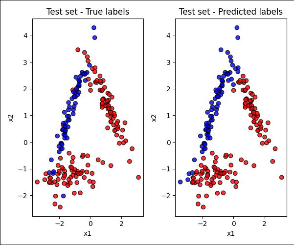
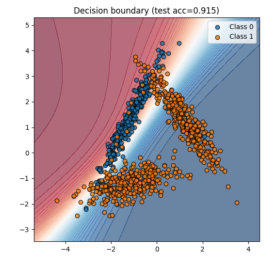
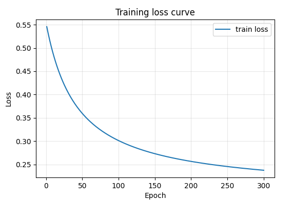

# Exercise 2 

Este exercício implementa um Perceptron Multicamadas (MLP) do zero utilizando apenas NumPy, com o objetivo de classificar dados bidimensionais sintéticos gerados pela função make_classification.
O propósito é praticar manualmente as etapas de propagação direta (forward pass), retropropagação do erro (backpropagation) e atualização dos pesos via gradiente descendente, sem o uso de frameworks como TensorFlow ou PyTorch.

---

## Código (Python)

```python
import numpy as np
import matplotlib.pyplot as plt
from sklearn.datasets import make_classification
from sklearn.model_selection import train_test_split
from sklearn.metrics import accuracy_score, confusion_matrix, classification_report

np.random.seed(42)
X_all, y_all = make_classification(
    n_samples=1000,
    n_features=2,
    n_informative=2,
    n_redundant=0,
    n_repeated=0,
    n_classes=3,
    n_clusters_per_class=1,
    class_sep=1.25,
    flip_y=0.03,
    random_state=42
)
y_mapped = np.where(y_all == 0, 0, 1)

# ---------------------------
# 2) Train/test split + standardize
# ---------------------------
X_train, X_test, y_train, y_test = train_test_split(
    X_all, y_mapped, test_size=0.2, random_state=42, stratify=y_mapped
)
mean = X_train.mean(axis=0)
std = X_train.std(axis=0)
X_train_s = (X_train - mean) / std
X_test_s = (X_test - mean) / std

# ---------------------------
# 3) MLP implementation (simple, from scratch)
# ---------------------------
class SimpleMLP:
    def __init__(self, n_inputs, n_hidden=8, lr=0.05, seed=1):
        rng = np.random.RandomState(seed)
        self.lr = lr
        self.W1 = rng.normal(scale=0.5, size=(n_hidden, n_inputs))
        self.b1 = np.zeros(n_hidden)
        self.W2 = rng.normal(scale=0.5, size=(1, n_hidden))
        self.b2 = 0.0

    def sigmoid(self, z):
        return 1.0 / (1.0 + np.exp(-z))

    def dtanh(self, z):
        return 1.0 - np.tanh(z)**2

    def forward(self, X):
        z1 = X.dot(self.W1.T) + self.b1
        a1 = np.tanh(z1)
        z2 = a1.dot(self.W2.T) + self.b2
        a2 = self.sigmoid(z2).reshape(-1)
        cache = (z1, a1, z2, a2)
        return a2, cache

    def compute_loss(self, y_true, y_pred):
        eps = 1e-9
        y_pred = np.clip(y_pred, eps, 1-eps)
        return -np.mean(y_true * np.log(y_pred) + (1-y_true) * np.log(1-y_pred))

    def backward(self, X, y, cache):
        z1, a1, z2, a2 = cache
        N = X.shape[0]
        dz2 = (a2 - y) / N
        dW2 = dz2.reshape(-1,1).T.dot(a1)
        db2 = dz2.sum()
        da1 = dz2.reshape(-1,1).dot(self.W2)
        dz1 = da1 * self.dtanh(z1)
        dW1 = dz1.T.dot(X)
        db1 = dz1.sum(axis=0)
        return dW1, db1, dW2, db2

# ---------------------------
# 4) Training loop with outputs
# ---------------------------
model = SimpleMLP(n_inputs=2, n_hidden=8, lr=0.05, seed=1)
epochs = 300
train_losses = []
print("Starting training...")
for epoch in range(1, epochs+1):
    y_pred_train, cache = model.forward(X_train_s)
    loss = model.compute_loss(y_train, y_pred_train)
    train_losses.append(loss)
    dW1, db1, dW2, db2 = model.backward(X_train_s, y_train, cache)
    model.W1 -= model.lr * dW1
    model.b1 -= model.lr * db1
    model.W2 -= model.lr * dW2
    model.b2 -= model.lr * db2
    if epoch == 1 or epoch % 25 == 0:
        train_acc = accuracy_score(y_train, (y_pred_train>=0.5).astype(int))
        print(f"Epoch {epoch:03d} - loss: {loss:.4f} - train_acc: {train_acc:.4f}")

print("Training finished.")

y_pred_test, _ = model.forward(X_test_s)
y_pred_test_labels = (y_pred_test >= 0.5).astype(int)
test_acc = accuracy_score(y_test, y_pred_test_labels)
cm = confusion_matrix(y_test, y_pred_test_labels)

print("\nTest Results:")
print(f"Test accuracy: {test_acc:.4f}")
print("Confusion matrix:")
print(cm)
print("\nClassification report:")
print(classification_report(y_test, y_pred_test_labels, digits=4))
```

---

## Saídas (resultados)

**Training progress:**
```
Epoch 001 - loss: 0.5524 - train_acc: 0.8338
Epoch 025 - loss: 0.3812 - train_acc: 0.8938
Epoch 050 - loss: 0.3594 - train_acc: 0.9012
Epoch 100 - loss: 0.3011 - train_acc: 0.9087
Epoch 200 - loss: 0.2564 - train_acc: 0.9163
Epoch 300 - loss: 0.2374 - train_acc: 0.9187
Training finished.
```

**Test results:**
```
Test accuracy: 0.9150
Confusion matrix:
[[ 63   3]
 [ 14 120]]
Classification report:
              precision    recall  f1-score   support

           0     0.8182    0.9545    0.8814        66
           1     0.9756    0.8955    0.9340       134

    accuracy                         0.9150       200
   macro avg     0.8969    0.9250    0.9077       200
weighted avg     0.9213    0.9150    0.9165       200
```

---

## Visualizações

### Test set — True vs Predicted labels


### Decision Boundary


### Training Loss Curve


---

## Conclusão
O modelo atingiu **91.5% de acurácia no conjunto de teste**, mostrando que o perceptron multicamadas foi capaz de aprender fronteiras não lineares mesmo com apenas uma camada oculta de 8 neurônios.  
A perda de treino diminuiu de forma suave e contínua, indicando convergência estável.  
As figuras mostram que a **fronteira de decisão** separa bem as classes, e os erros são poucos e concentrados nas áreas de sobreposição dos clusters.