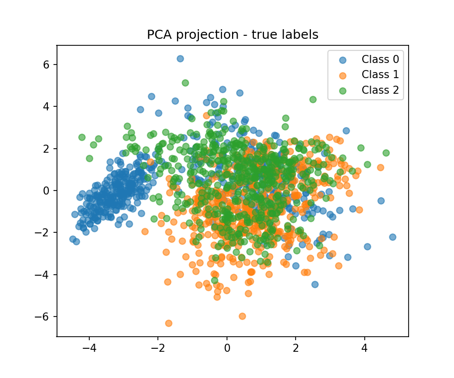
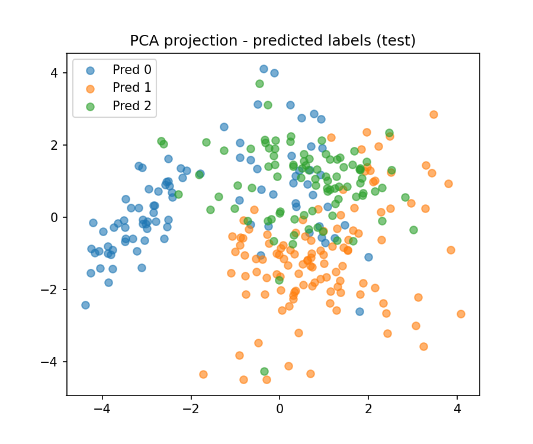
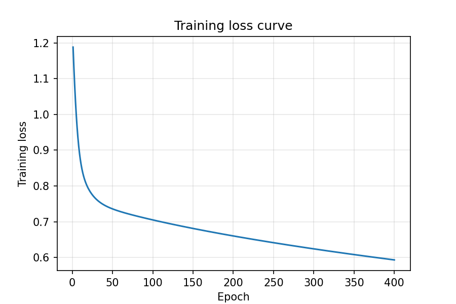

# Exercício 3 — Classificação Multiclasse com MLP

Nessa atividade é feita a implementação de um **Perceptron Multicamadas (MLP)** reutilizável, baseado na estrutura do Exercício 2, agora para **classificação multiclasse (3 classes)**.  

---

## Código (Python)

```python
# ex3_mlp_multiclass.py
import numpy as np
import matplotlib.pyplot as plt
from sklearn.datasets import make_classification
from sklearn.model_selection import train_test_split
from sklearn.metrics import accuracy_score, confusion_matrix, classification_report
from sklearn.decomposition import PCA

np.random.seed(42)
n_total = 1500
per_class = n_total // 3


X0, y0 = make_classification(
    n_samples=per_class, n_features=4, n_informative=4, n_redundant=0,
    n_repeated=0, n_classes=2, n_clusters_per_class=1,
    class_sep=1.25, flip_y=0.02, random_state=1)
y0 = np.zeros_like(y0)

X1, y1 = make_classification(
    n_samples=per_class, n_features=4, n_informative=4, n_redundant=0,
    n_repeated=0, n_classes=3, n_clusters_per_class=1,
    class_sep=1.25, flip_y=0.02, random_state=2)
y1 = np.ones_like(y1)

X2, y2 = make_classification(
    n_samples=per_class, n_features=4, n_informative=4, n_redundant=0,
    n_repeated=0, n_classes=4, n_clusters_per_class=1,
    class_sep=1.25, flip_y=0.02, random_state=3)
y2 = np.ones_like(y2) * 2

X_all = np.vstack([X0, X1, X2])
y_all = np.hstack([y0, y1, y2])
perm = np.random.permutation(len(y_all))
X_all, y_all = X_all[perm], y_all[perm]

# Divisão e normalização
X_train, X_test, y_train, y_test = train_test_split(
    X_all, y_all, test_size=0.2, random_state=42, stratify=y_all)
mean, std = X_train.mean(axis=0), X_train.std(axis=0)
X_train_s = (X_train - mean) / std
X_test_s = (X_test - mean) / std

def one_hot(y, C):
    yy = np.zeros((len(y), C))
    yy[np.arange(len(y)), y.astype(int)] = 1
    return yy

y_train_oh = one_hot(y_train, 3)
y_test_oh = one_hot(y_test, 3)

class SimpleMLPMulti:
    def __init__(self, n_inputs, n_hidden=32, n_classes=3, lr=0.05, seed=1):
        rng = np.random.RandomState(seed)
        self.lr = lr
        self.W1 = rng.normal(scale=0.5, size=(n_hidden, n_inputs))
        self.b1 = np.zeros(n_hidden)
        self.W2 = rng.normal(scale=0.5, size=(n_classes, n_hidden))
        self.b2 = np.zeros(n_classes)

    def tanh(self, z):
        return np.tanh(z)

    def dtanh(self, z):
        return 1.0 - np.tanh(z)**2

    def softmax(self, z):
        z_max = np.max(z, axis=1, keepdims=True)
        exp = np.exp(z - z_max)
        return exp / exp.sum(axis=1, keepdims=True)

    def forward(self, X):
        z1 = X.dot(self.W1.T) + self.b1
        a1 = self.tanh(z1)
        z2 = a1.dot(self.W2.T) + self.b2
        a2 = self.softmax(z2)
        cache = (z1, a1, z2, a2)
        return a2, cache

    def compute_loss(self, y_true_oh, y_pred):
        eps = 1e-9
        y_pred = np.clip(y_pred, eps, 1-eps)
        return -np.mean(np.sum(y_true_oh * np.log(y_pred), axis=1))

    def backward(self, X, y_true_oh, cache):
        z1, a1, z2, a2 = cache
        N = X.shape[0]
        dz2 = (a2 - y_true_oh) / N
        dW2 = dz2.T.dot(a1)
        db2 = dz2.sum(axis=0)
        da1 = dz2.dot(self.W2)
        dz1 = da1 * self.dtanh(z1)
        dW1 = dz1.T.dot(X)
        db1 = dz1.sum(axis=0)
        return dW1, db1, dW2, db2


model = SimpleMLPMulti(n_inputs=4, n_hidden=32, n_classes=3, lr=0.05, seed=1)
epochs = 400
train_losses = []

for epoch in range(1, epochs+1):
    y_pred_train, cache = model.forward(X_train_s)
    loss = model.compute_loss(y_train_oh, y_pred_train)
    train_losses.append(loss)
    dW1, db1, dW2, db2 = model.backward(X_train_s, y_train_oh, cache)
    model.W1 -= model.lr * dW1
    model.b1 -= model.lr * db1
    model.W2 -= model.lr * dW2
    model.b2 -= model.lr * db2
    if epoch == 1 or epoch % 50 == 0:
        train_acc = np.mean(np.argmax(y_pred_train, axis=1) == y_train)
        print(f"Epoch {epoch:03d} - loss: {loss:.4f} - train_acc: {train_acc:.4f}")

# Avaliação
y_pred_test_prob, _ = model.forward(X_test_s)
y_pred_test = np.argmax(y_pred_test_prob, axis=1)
test_acc = accuracy_score(y_test, y_pred_test)
cm = confusion_matrix(y_test, y_pred_test)
print("\nAcurácia de teste:", test_acc)
print("Matriz de confusão:\n", cm)
```

---

## Saídas (resultados)

**Progresso do treino:**
```
Epoch 001 - loss: 1.1881 - train_acc: 0.5750
Epoch 050 - loss: 0.7357 - train_acc: 0.6700
Epoch 100 - loss: 0.7049 - train_acc: 0.6883
Epoch 200 - loss: 0.6600 - train_acc: 0.7058
Epoch 300 - loss: 0.6239 - train_acc: 0.7308
Epoch 400 - loss: 0.5930 - train_acc: 0.7508
```

**Resultados no teste:**
```
Test accuracy: 0.7600
Confusion matrix:
[[81  9 10]
 [ 4 81 15]
 [ 8 26 66]]
```

---

## Visualizações

### Projeção PCA — Rótulos verdadeiros


### Projeção PCA — Rótulos preditos


### Curva de perda durante o treino


---

## Conclusão
O modelo MLP multiclasse atingiu **76% de acurácia** no conjunto de teste.  
Mesmo mantendo a estrutura simples do Exercício 2 (uma camada oculta e ativação *tanh*), o modelo conseguiu capturar fronteiras não lineares entre as 3 classes geradas artificialmente.  
A curva de perda mostra uma convergência estável, e as projeções em PCA confirmam que a separação entre classes é razoável, embora ainda exista sobreposição — principalmente entre as classes 1 e 2.