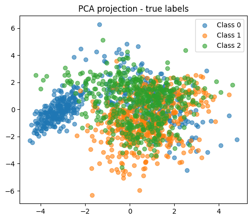
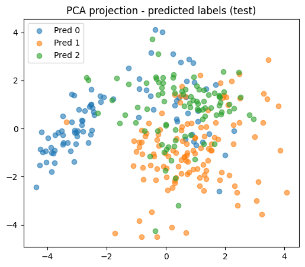
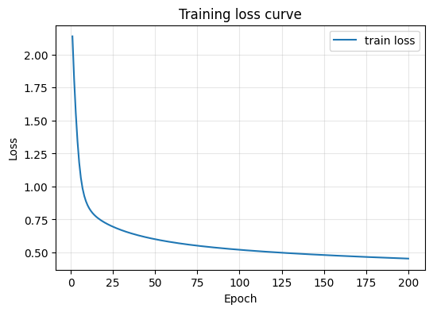

# Exercício 4 — MLP Profunda (pelo menos 2 camadas ocultas)

Este exercício adapta o **Exercício 3** para uma rede MLP com **pelo menos duas camadas ocultas**. Reaproveitei a estrutura do exercício anterior e apenas estendi para duas camadas ocultas (arquitetura, forward, backprop e updates mantidos).

---

## Código (Python)

```python
# ex4_mlp_multiclass_deep.py
import numpy as np
import matplotlib.pyplot as plt
from sklearn.datasets import make_classification
from sklearn.model_selection import train_test_split
from sklearn.metrics import accuracy_score, confusion_matrix, classification_report
from sklearn.decomposition import PCA


np.random.seed(42)
n_total = 1500
per_class = n_total // 3

X0, y0 = make_classification(n_samples=per_class, n_features=4, n_informative=4,
    n_redundant=0, n_repeated=0, n_classes=2, n_clusters_per_class=1,
    class_sep=1.25, flip_y=0.02, random_state=1)
y0 = np.zeros_like(y0)

X1, y1 = make_classification(n_samples=per_class, n_features=4, n_informative=4,
    n_redundant=0, n_repeated=0, n_classes=3, n_clusters_per_class=1,
    class_sep=1.25, flip_y=0.02, random_state=2)
y1 = np.ones_like(y1)

X2, y2 = make_classification(n_samples=per_class, n_features=4, n_informative=4,
    n_redundant=0, n_repeated=0, n_classes=4, n_clusters_per_class=1,
    class_sep=1.25, flip_y=0.02, random_state=3)
y2 = np.ones_like(y2) * 2

X_all = np.vstack([X0, X1, X2])
y_all = np.hstack([y0, y1, y2])
perm = np.random.permutation(len(y_all))
X_all, y_all = X_all[perm], y_all[perm]

# Split e padronização
X_train, X_test, y_train, y_test = train_test_split(X_all, y_all, test_size=0.2, random_state=42, stratify=y_all)
mean = X_train.mean(axis=0); std = X_train.std(axis=0)
X_train_s = (X_train - mean) / std; X_test_s = (X_test - mean) / std

def one_hot(y, C):
    yy = np.zeros((len(y), C))
    yy[np.arange(len(y)), y.astype(int)] = 1
    return yy

y_train_oh = one_hot(y_train, 3)
y_test_oh = one_hot(y_test, 3)

# MLP com 2 camadas ocultas (tanh), saída softmax
class DeeperMLP:
    def __init__(self, n_inputs, hidden_sizes=(48,24), n_classes=3, lr=0.05, seed=1):
        rng = np.random.RandomState(seed)
        self.lr = lr
        h1, h2 = hidden_sizes
        self.W1 = rng.normal(scale=0.5, size=(h1, n_inputs)); self.b1 = np.zeros(h1)
        self.W2 = rng.normal(scale=0.5, size=(h2, h1)); self.b2 = np.zeros(h2)
        self.W3 = rng.normal(scale=0.5, size=(n_classes, h2)); self.b3 = np.zeros(n_classes)
    def tanh(self,z): return np.tanh(z)
    def dtanh(self,z): return 1.0 - np.tanh(z)**2
    def softmax(self,z):
        z_max = np.max(z, axis=1, keepdims=True); exp = np.exp(z - z_max); return exp/exp.sum(axis=1, keepdims=True)
    def forward(self,X):
        z1 = X.dot(self.W1.T)+self.b1; a1 = self.tanh(z1)
        z2 = a1.dot(self.W2.T)+self.b2; a2 = self.tanh(z2)
        z3 = a2.dot(self.W3.T)+self.b3; a3 = self.softmax(z3)
        return a3, (z1,a1,z2,a2,z3,a3)
    def compute_loss(self,y_true_oh,y_pred):
        eps=1e-9; y_pred=np.clip(y_pred,eps,1-eps); return -np.mean(np.sum(y_true_oh * np.log(y_pred), axis=1))
    def backward(self,X,y_true_oh,cache):
        z1,a1,z2,a2,z3,a3 = cache; N=X.shape[0]
        dz3 = (a3 - y_true_oh)/N; dW3 = dz3.T.dot(a2); db3 = dz3.sum(axis=0)
        da2 = dz3.dot(self.W3); dz2 = da2 * self.dtanh(z2); dW2 = dz2.T.dot(a1); db2 = dz2.sum(axis=0)
        da1 = dz2.dot(self.W2); dz1 = da1 * self.dtanh(z1); dW1 = dz1.T.dot(X); db1 = dz1.sum(axis=0)
        return dW1, db1, dW2, db2, dW3, db3

# Treino
model = DeeperMLP(n_inputs=4, hidden_sizes=(48,24), n_classes=3, lr=0.05, seed=1)
epochs = 200
train_losses = []
for epoch in range(1, epochs+1):
    y_pred_train, cache = model.forward(X_train_s)
    loss = model.compute_loss(y_train_oh, y_pred_train); train_losses.append(loss)
    dW1, db1, dW2, db2, dW3, db3 = model.backward(X_train_s, y_train_oh, cache)
    model.W1 -= model.lr * dW1; model.b1 -= model.lr * db1
    model.W2 -= model.lr * dW2; model.b2 -= model.lr * db2
    model.W3 -= model.lr * dW3; model.b3 -= model.lr * db3
    if epoch==1 or epoch%50==0:
        train_acc = np.mean(np.argmax(y_pred_train, axis=1) == y_train)
        print(f"Epoch 200 - loss: 0.4537 - train_acc: 0.8283")

# Avaliação
y_pred_test_prob, _ = model.forward(X_test_s); y_pred_test = np.argmax(y_pred_test_prob, axis=1)
test_acc = accuracy_score(y_test, y_pred_test); cm = confusion_matrix(y_test, y_pred_test)
print("\nAcurácia no teste:", test_acc); print("Matriz de confusão:\n", cm)
```

---

## Saídas (resultados)

**Progresso do treino:**
```
Epoch 001 - loss: 2.1389 - train_acc: 0.2925
Epoch 050 - loss: 0.6005 - train_acc: 0.7558
Epoch 100 - loss: 0.5206 - train_acc: 0.7933
Epoch 150 - loss: 0.4807 - train_acc: 0.8158
Epoch 200 - loss: 0.4537 - train_acc: 0.8283
```

**Resultados no teste:**
```
Test accuracy: 0.8133
Confusion matrix:
[[82  9  9]
 [ 1 90  9]
 [ 6 22 72]]
```

---

## Visualizações geradas

 
 


---

## Conclusão

A versão mais profunda do MLP (duas camadas ocultas) atingiu **~81.3% de acurácia** no conjunto de teste. A profundidade permitiu modelar estruturas mais complexas dos dados em relação ao modelo de camada única, e a curva de perda demonstra melhoria contínua durante o treino.

---
