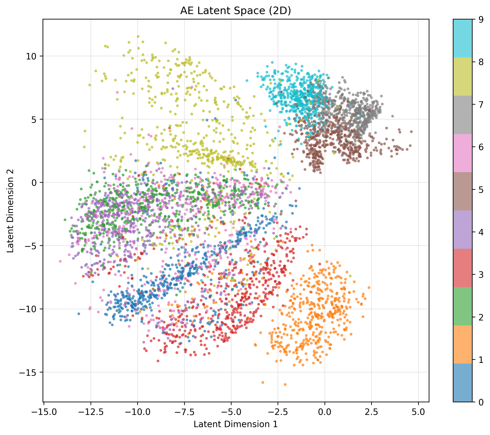
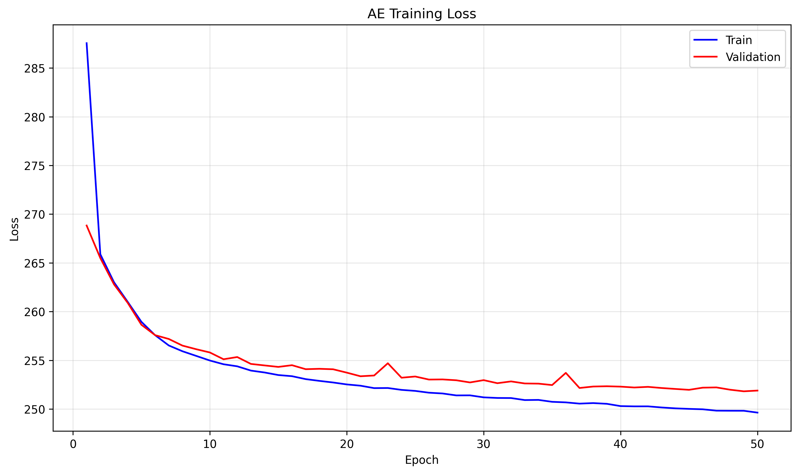
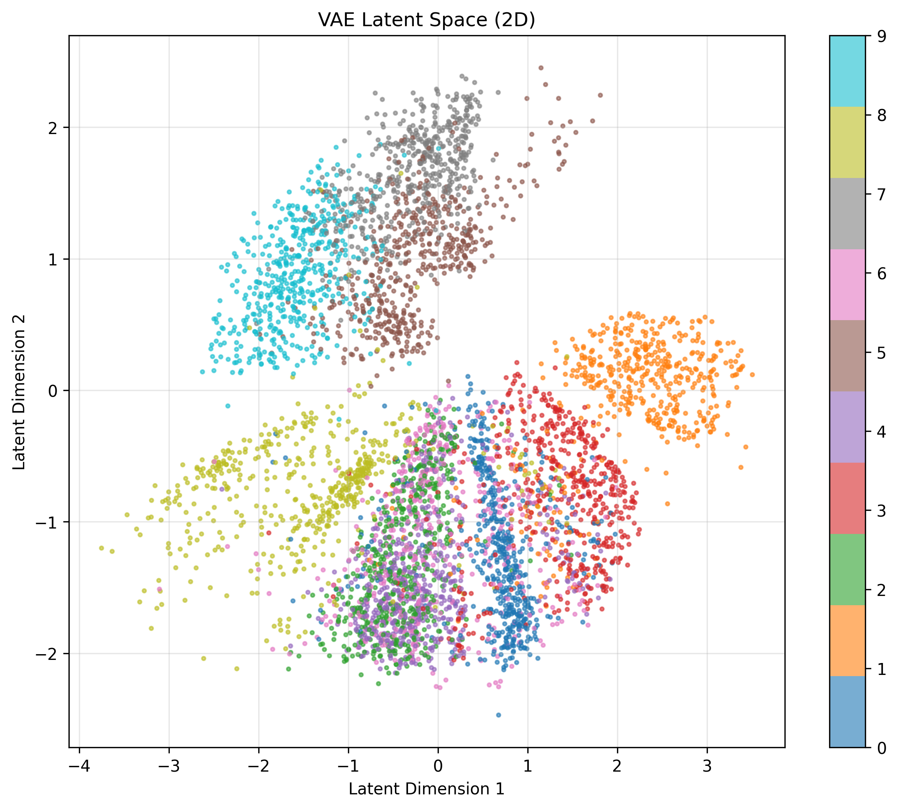
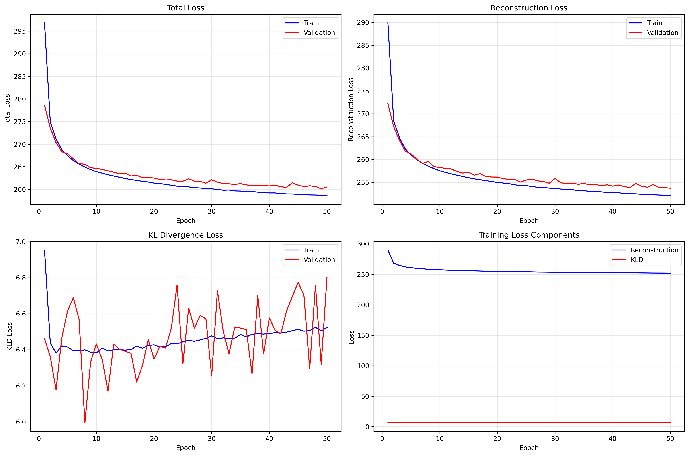

# Exercicio - VAE (Variational Autoencoder)

Este exercício realiza o treino, a arquitetura e os resultados do VAE treinado (entrada 784 -> hidden 400 -> latent 2), além da comparacão com um Autoencoder padrao (AE).

## Arquitetura e hiperparametros

Resumo:

- Input dimension: 784
- Hidden dimension: 400
- Latent dimension: 2
- Epocas: 50
- Total de parametros (reportado): 631188

## Treino do VAE - logs principais

Treino resumido por Epoch (valores medios por conjunto):

```
Epoch 1/50:
  Train - Loss: 296.8121, Recon: 289.8587, KLD: 6.9534
  Val   - Loss: 278.6441, Recon: 272.1831, KLD: 6.4611
-> Best model saved!

Epoch 10/50:
  Train - Loss: 263.9139, Recon: 257.5315, KLD: 6.3824
  Val   - Loss: 264.6695, Recon: 258.2373, KLD: 6.4322
-> Best model saved!

Epoch 25/50:
  Train - Loss: 260.7063, Recon: 254.2618, KLD: 6.4445
  Val   - Loss: 261.8023, Recon: 255.4813, KLD: 6.3210
-> Best model saved!

Epoch 50/50:
  Train - Loss: 258.6138, Recon: 252.0897, KLD: 6.5241
  Val   - Loss: 260.5285, Recon: 253.7263, KLD: 6.8022
```

O log detalhado mostra que o modelo salvou o checkpoint "best" varias vezes ao longo do treino com melhora na validação.

## Avaliacao final (teste)

```
Test Performance:
  Total Loss: 261.0976
  Reconstruction Loss: 254.7975
  KLD Loss: 6.3000
```

## Trechos de codigo relevantes

Classe VAE :

```python
class VAE(nn.Module):
    def __init__(self, input_dim=784, hidden_dim=400, latent_dim=2):
        super(VAE, self).__init__()
        self.fc1 = nn.Linear(input_dim, hidden_dim)
        self.fc_mu = nn.Linear(hidden_dim, latent_dim)
        self.fc_log_var = nn.Linear(hidden_dim, latent_dim)
        self.fc3 = nn.Linear(latent_dim, hidden_dim)
        self.fc4 = nn.Linear(hidden_dim, input_dim)

    def encode(self, x):
        h = F.relu(self.fc1(x))
        mu = self.fc_mu(h)
        log_var = self.fc_log_var(h)
        return mu, log_var

    def reparameterize(self, mu, log_var):
        std = torch.exp(0.5 * log_var)
        eps = torch.randn_like(std)
        return mu + eps * std

    def decode(self, z):
        h = F.relu(self.fc3(z))
        x_recon = torch.sigmoid(self.fc4(h))
        return x_recon

    def forward(self, x):
        mu, log_var = self.encode(x)
        z = self.reparameterize(mu, log_var)
        x_recon = self.decode(z)
        return x_recon, mu, log_var
```

Função de perda do VAE:

```python
def vae_loss(x_recon, x, mu, log_var):
    recon_loss = F.binary_cross_entropy(x_recon, x, reduction='sum')
    kld_loss = -0.5 * torch.sum(1 + log_var - mu.pow(2) - log_var.exp())
    total_loss = recon_loss + kld_loss
    return total_loss, recon_loss, kld_loss
```

Treinamento:

```python
for epoch in range(1, EPOCHS+1):
    train_loss, train_recon, train_kld = train_vae(model, train_loader, optimizer, epoch)
    val_loss, val_recon, val_kld = validate_vae(model, val_loader)
    
```

## Visualizacoes geradas

### AE Latent Space (2D)


Projeção 2D do espaço latente do Autoencoder padrão. Cada ponto eh uma imagem do dataset codificada em 2 dimensões; as cores representam as classes. Observa-se grupos parcialmente separados, porém com sobreposições mais evidentes, pois o AE não eh forçado a organizar o latente como distribuição (sem termo KLD).

### AE Training Curves


Curva de perda de treino e validação do AE ao longo das épocas (apenas reconstrução). A queda rápida inicial indica aprendizado das estruturas globais; a convergência gradual mostra refinamento das reconstruções. Pequenas variações na validação sugerem leve oscilação, mas sem overfitting marcante.


### VAE Latent Space (2D)


Projeção 2D do espaço latente do VAE. Em comparação ao AE, os clusters tendem a ficar um pouco mais compactos e organizados graças ao termo KLD, que incentiva distribuições próximas de Normal. Ainda há interseções entre classes com aparência semelhante.

### VAE Training Curves


Quatro painéis de curvas do VAE: (superior esquerdo) perda total; (superior direito) perda de reconstrução; (inferior esquerdo) KLD; (inferior direito) componentes de perda no treino. A reconstrução cai rapidamente, enquanto o KLD estabiliza entre ~6.3 e ~6.7 nats, equilibrando fidelidade da reconstrução e regularização do latente.

## Comparacao com Autoencoder padrao (AE)

Treino do AE (extra credit):

```
AE final (valores de exemplo):
  Melhor Val Loss reportado ao longo do treino por checkpoints
  Ex.: Epoch 1 AE Val Loss: 268.8340 (melhor salvo)
  Ao final: Val Loss proximos de 253..256 conforme logs
```

O AE apresenta reconstruções competitivas e perda de reconstrução ligeiramente menor que a parte de recon do VAE (por construção o VAE soma o termo KLD), mas o VAE também aprende a distribuição latente e permite amostragem e geração de novas imagens.


