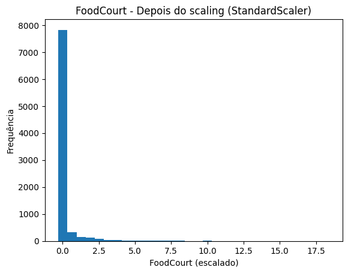

# Exercício 3 — Preparando Dados Reais para Rede Neural 

###  Obtenção dos Dados
Para esse exercício, foi utilizado o dataset Spaceship Titanic, disponível no Kaggle, foi utilizado AI para auxílio no código.


###  Descrevendo o Conjunto de Dados

O dataset tem como objetivo prever se um passageiro foi transportado para outra dimensão (coluna `Transported`, valores True/False).

### Principais *features*
- **Numéricas:** `Age`, `RoomService`, `FoodCourt`, `ShoppingMall`, `Spa`, `VRDeck` e a derivada `CabinNum` (extraída de `Cabin`).
- **Categóricas:** `HomePlanet`, `CryoSleep`, `Destination`, `VIP` e, a partir de `Cabin`, as novas `Deck` e `Side`.
- **Identificadores (removidos de X):** `PassengerId`, `Name` (mantidos apenas como metadados).


### Código

```python
import os
import pandas as pd
import numpy as np
import matplotlib.pyplot as plt
from sklearn.compose import ColumnTransformer
from sklearn.preprocessing import OneHotEncoder, StandardScaler
from sklearn.impute import SimpleImputer
from sklearn.pipeline import Pipeline
import joblib

TRAIN = os.path.join(".", "train.csv")
TEST = os.path.join(".", "test.csv")

train_df = pd.read_csv(TRAIN)
test_df = pd.read_csv(TEST)

# Keep raw for plots
train_raw = train_df.copy()

target_col = "Transported" if "Transported" in train_df.columns else None
id_like = [c for c in ["PassengerId", "Name"] if c in train_df.columns]

def split_cabin(df):
    if "Cabin" in df.columns:
        parts = df["Cabin"].astype(str).str.split("/", expand=True)
        if parts.shape[1] >= 3:
            df["Deck"] = parts[0].replace("nan", np.nan)
            df["CabinNum"] = pd.to_numeric(parts[1].replace("nan", np.nan), errors="coerce")
            df["Side"] = parts[2].replace("nan", np.nan)
        elif parts.shape[1] == 2:
            df["Deck"] = parts[0].replace("nan", np.nan)
            df["CabinNum"] = pd.to_numeric(parts[1].replace("nan", np.nan), errors="coerce")
            df["Side"] = np.nan
        else:
            df["Deck"], df["CabinNum"], df["Side"] = np.nan, np.nan, np.nan
        df.drop(columns=["Cabin"], inplace=True)
```
A coluna Cabin vem no formato Deck/CabinNum/Side (ex.: “B/19/P”). Foi divido essa string em três variáveis: Deck (categórica), CabinNum (numérica) e Side (categórica). Quando faltam partes, é preenchido com NaN e substituido "nan" por NaN. Por fim, foi retirado a Cabin original para reduzir cardinalidade e ficar com atributos mais fáceis de codificar e escalar.

```python
split_cabin(train_df)
split_cabin(test_df)

preferred_numeric = [c for c in ["Age","RoomService","FoodCourt","ShoppingMall","Spa","VRDeck","CabinNum"] if c in train_df.columns]
auto_numeric = [c for c in train_df.select_dtypes(include=[np.number]).columns if c != target_col]
num_cols = sorted(list(set(preferred_numeric) | set(auto_numeric)))

cat_cols = [c for c in train_df.columns if (train_df[c].dtype == "object" or train_df[c].dtype == "bool")]
cat_cols = [c for c in cat_cols if c not in (set(id_like) | {target_col})]

feature_cols = [c for c in train_df.columns if c not in (set(id_like) | {target_col})]

# Missing values table
missing_counts = train_raw.isnull().sum().reset_index()
missing_counts.columns = ["column","n_missing"]
missing_counts["pct_missing"] = (missing_counts["n_missing"] / len(train_raw) * 100).round(2)
missing_counts.to_csv("missing_values_train.csv", index=False)

# Preprocess pipeline
numeric_transformer = Pipeline(
    steps=[("imputer", SimpleImputer(strategy="median")),
           ("scaler", StandardScaler())]
)
categorical_transformer = Pipeline(
    steps=[("imputer", SimpleImputer(strategy="most_frequent")),
           ("onehot", OneHotEncoder(handle_unknown="ignore", sparse=False))]
)
preprocess = ColumnTransformer(
    transformers=[("num", numeric_transformer, num_cols),
                  ("cat", categorical_transformer, cat_cols)]
)

X_train = train_df[feature_cols].copy()
X_test = test_df[feature_cols].copy()
y_train = train_df[target_col].astype(int) if target_col else None

X_train_proc = preprocess.fit_transform(X_train)
X_test_proc = preprocess.transform(X_test)

num_names = num_cols
cat_names = list(preprocess.named_transformers_["cat"].named_steps["onehot"].get_feature_names_out(cat_cols))
proc_columns = list(num_names) + list(cat_names)

X_train_proc_df = pd.DataFrame(X_train_proc, columns=proc_columns, index=train_df.index)
X_test_proc_df = pd.DataFrame(X_test_proc, columns=proc_columns, index=test_df.index)

X_train_proc_df.to_csv("processed_train_features.csv", index=False)
X_test_proc_df.to_csv("processed_test_features.csv", index=False)
if y_train is not None:
    pd.Series(y_train, name=target_col).to_csv("processed_train_labels.csv", index=False)
```
Foi aplicado o split_cabin ao train e ao test para substituir Cabin por Deck, CabinNum e Side, após isso foi definido as colunas numéricas combinando uma lista “preferida” (Age, gastos e CabinNum) com a detecção automática de colunas de tipo numérico, e definido as categóricas como as de texto/booleanas, excluindo identificadores (PassengerId, Name) e o alvo (Transported). A lista feature_cols reúne todas as variáveis de entrada (tudo menos IDs e alvo), isso foi salvo em missing_values_train.csv, após a preparação dos dados foram salvos os arquivos processed_train_features.csv, processed_test_features.csv e, se houver alvo, processed_train_labels.csv.

```python
joblib.dump({"pipeline": preprocess,
             "feature_cols": feature_cols,
             "num_cols": num_cols,
             "cat_cols": cat_cols}, "preprocess_pipeline.joblib")

# Plots
if "Age" in train_raw.columns:
    plt.figure()
    train_raw["Age"].dropna().plot(kind="hist", bins=30)
    plt.title("Age - Antes do scaling")
    plt.xlabel("Age (original)")
    plt.ylabel("Frequência")
    plt.savefig("age_before.png", bbox_inches="tight")
    plt.close()

    age_idx = num_cols.index("Age")
    age_scaled = X_train_proc[:, age_idx]
    plt.figure()
    pd.Series(age_scaled).plot(kind="hist", bins=30)
    plt.title("Age - Depois do scaling (StandardScaler)")
    plt.xlabel("Age (escalado)")
    plt.ylabel("Frequência")
    plt.savefig("age_after.png", bbox_inches="tight")
    plt.close()

candidates = [c for c in ["FoodCourt","VRDeck","RoomService","Spa","ShoppingMall"] if c in train_raw.columns]
if candidates:
    second_feat = candidates[0]
    plt.figure()
    train_raw[second_feat].dropna().plot(kind="hist", bins=30)
    plt.title(f"{second_feat} - Antes do scaling")
    plt.xlabel(f"{second_feat} (original)")
    plt.ylabel("Frequência")
    plt.savefig(f"{second_feat.lower()}_before.png", bbox_inches="tight")
    plt.close()

    idx = num_cols.index(second_feat)
    scaled_vals = X_train_proc[:, idx]
    plt.figure()
    pd.Series(scaled_vals).plot(kind="hist", bins=30)
    plt.title(f"{second_feat} - Depois do scaling (StandardScaler)")
    plt.xlabel(f"{second_feat} (escalado)")
    plt.ylabel("Frequência")
    plt.savefig(f"{second_feat.lower()}_after.png", bbox_inches="tight")
    plt.close()
```

Foi salvo pipeline e metadados em preprocess_pipeline.joblib para reuso e reprodução das mesmas transformações em validação/produção. Depois, foi gerado histogramas para Age e para uma segunda variável numérica disponível (entre FoodCourt, VRDeck, RoomService, Spa, ShoppingMall), mostrando antes e depois do StandardScaler.


### Visualizações (antes × depois do *scaling*)

- **Age**:  
   
  

- **FoodCourt**:  
    
  


Antes da padronização, as variáveis apresentaram diferentes escalas e distribuições, o que pode dificultar o treinamento da rede neural. Após o scaling, os dados ficaram centrados e com variância padronizada,

### Saídas Geradas 
- `processed_train_features.csv` — *features* do treino já imputadas, *one-hot* e escaladas.
- `processed_train_labels.csv` — rótulos do treino (`Transported` → 0/1).
- `processed_test_features.csv` — *features* do teste processadas com o mesmo pipeline.
- `preprocess_pipeline.joblib` — pipeline do scikit-learn para reuso e reprodutibilidade.
