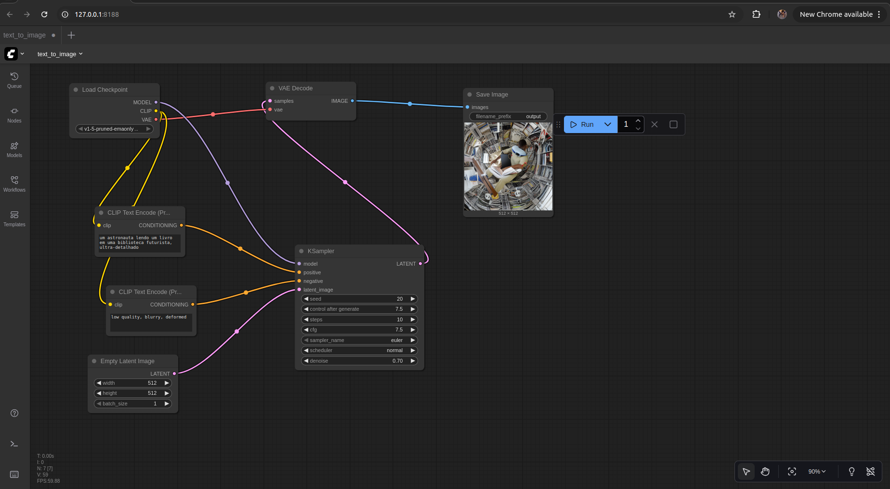

# Relatório - Geração de Imagem com Stable Diffusion (ComfyUI)

## 1. Objetivo

Implementar e executar um pipeline Text-to-Image usando o ComfyUI e o modelo Stable Diffusion v1.5, demonstrando o funcionamento de um modelo generativo difusional a partir de prompts de texto.

## 2. Ferramentas e recursos

- **Framework:** ComfyUI
- **Modelo:** v1-5-pruned-emaonly.safetensors (Stable Diffusion v1.5)
- **Ambiente:** Ubuntu + Python 3.10 + GPU NVIDIA (CUDA ativada)
- **Linguagem:** Prompt textual em português
- **Saídas:** Imagens geradas (.png) na pasta ComfyUI/output/

## 3. Arquitetura do pipeline

A arquitetura do fluxo segue a estrutura clássica de um modelo difusional.
Cada node do ComfyUI representa uma etapa do processo:

| Etapa | Node (Bloco) | Função |
|-------|--------------|--------|
| 1 | Load Checkpoint | Carrega o modelo pré-treinado do Stable Diffusion (v1.5). Fornece o UNet (MODEL), o codificador de texto (CLIP) e o decodificador (VAE). |
| 2 | CLIP Text Encode (Prompt) | Converte o prompt textual positivo ("o que queremos ver") em embeddings vetoriais. |
| 3 | CLIP Text Encode (Negative Prompt) | Converte o prompt negativo ("o que queremos evitar") em embeddings vetoriais. |
| 4 | Empty Latent Image | Cria um tensor latente de ruído inicial (512x512x4). |
| 5 | KSampler | Realiza o processo de difusão inversa, refinando o ruído inicial segundo o prompt, usando UNet + CFG + steps. |
| 6 | VAE Decode | Decodifica o latente final em imagem RGB. |
| 7 | Save Image | Salva a imagem final gerada. |

## 4. Conexões entre os nodes

| Origem | Saida | Destino | Entrada |
|--------|-------|---------|---------|
| Load Checkpoint | MODEL | KSampler | model |
| CLIP Text Encode (Prompt) | CONDITIONING | KSampler | positive |
| CLIP Text Encode (Negative) | CONDITIONING | KSampler | negative |
| Empty Latent Image | LATENT | KSampler | latent_image |
| KSampler | LATENT | VAE Decode | samples |
| Load Checkpoint | VAE | VAE Decode | vae |
| VAE Decode | IMAGE | Save Image | images |

## 5. Parâmetros utilizados

| Parâmetro | Valor |
|-----------|-------|
| Steps | 20 |
| CFG Scale | 7.5 |
| Sampler | euler |
| Denoise | 0.7 |
| Seed | -1 (aleatório) |
| Dimensões da imagem | 512x512 |
| Batch size | 1 |

## 6. Prompts utilizados

**Prompt positivo:**
```
um astronauta lendo um livro em uma biblioteca futurista, ultra-detalhado
```

**Prompt negativo:**
```
low quality, blurry, deformed
```

## 7. Resultados

A imagem foi gerada com sucesso conforme o prompt, mostrando um astronauta em ambiente futurista, boa definição e ausência de artefatos.

A imagem resultante foi salva automaticamente em:
```
ComfyUI/output/
```

Exemplo de arquivo:
```
output_00001.png
```

### Pipeline do ComfyUI



A imagem acima mostra o grafo completo de nodes usado no ComfyUI, com todas as conexões entre Load Checkpoint, CLIP Text Encode, KSampler, VAE Decode e Save Image.

## 8. Discussão

- O ComfyUI permitiu visualizar todo o fluxo de geração, facilitando o entendimento das etapas internas do Stable Diffusion.
- O uso de prompt negativo melhorou a nitidez e reduziu deformações.
- Com os parametros ajustados (20 steps, CFG 7.5, denoise 0.7), o modelo equilibrou velocidade e qualidade.

## 9. Conclusão

O pipeline implementado demonstra a geração de imagens realistas a partir de texto usando difusão latente.
Essa estrutura servirá como base para a atividade Generative Project, podendo ser estendida com ControlNet, LoRA ou img2img.

---

## Autores

- Luiz Guilherme Ferreira Alves
- Ian Faray
- Antônio Filho
